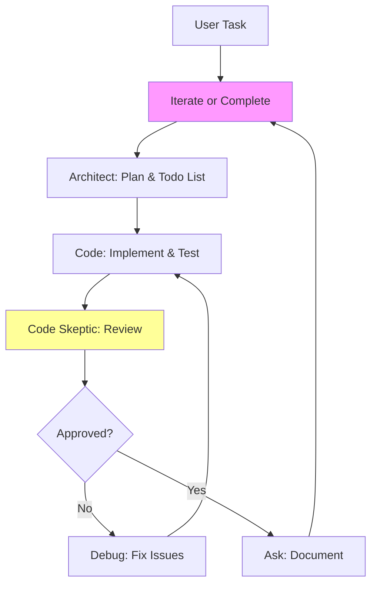

# Agents

## Introduction

The TPC-server project leverages a sophisticated system of interconnected AI agents to super-power development workflows. These agents are modular AI specialists, each inspired by specialized modes, that can be activated via prompts or tools like `switch_mode`. This framework transforms routine tasks into efficient, collaborative processes, integrating seamlessly with project tools such as Playwright for end-to-end testing, JSON data files (e.g., plans.json, thoughts.json) for planning and reflection, and server.js for backend logic.

Agents collaborate through defined protocols: delegation for task breakdown, review for quality assurance, and iteration for refinement. This system enhances the project's focus on testing (Jest and Playwright), data management, and server operations, enabling AI-driven automation and innovation.

## Current Agents

Each agent has a name, slug (for mode switching), role, capabilities (including power-ups tied to TPC-server), limitations, and interaction rules.

- **Kilo Code**  
  **Slug:** kilo-code  
  **Role:** Generalist software engineer overseeing all operations.  
  **Capabilities:** Code generation, debugging, project management; acts as a hub for initial task intake and final synthesis. Power-up: Coordinates with server.js to simulate API interactions during planning.  
  **Limitations:** Cannot directly execute code; relies on delegation.  
  **Interaction Rules:** Invoke as default for broad tasks; use `switch_mode` to delegate to specialists.

- **Architect**  
  **Slug:** architect  
  **Role:** High-level planner and designer.  
  **Capabilities:** Breaks down tasks into todo lists using `update_todo_list`, creates Mermaid diagrams for architecture, outlines workflows. Power-up: Integrates with CHECKLISTS/Phases.md and plans.json to generate phased development plans.  
  **Limitations:** Restricted to non-code edits (e.g., only .md files); no direct implementation.  
  **Interaction Rules:** Activate via `switch_mode` for planning phases; outputs plans for Orchestrator review.

- **Code**  
  **Slug:** code  
  **Role:** Implementation specialist.  
  **Capabilities:** Writes, refactors, and edits code using tools like `write_to_file`, `apply_diff`; handles server.js logic and test files. Power-up: Generates Jest/Playwright test cases tied to v*.test.js patterns.  
  **Limitations:** Focuses on code only; defers planning to Architect.  
  **Interaction Rules:** Delegated by Orchestrator; outputs code for Code Skeptic review.

- **Ask**  
  **Slug:** ask  
  **Role:** Knowledge and explanation expert.  
  **Capabilities:** Provides documentation, answers queries, analyzes code via `list_code_definition_names` or `search_files`. Power-up: Queries thoughts.json for reflective insights on project decisions.  
  **Limitations:** Informational only; no modifications.  
  **Interaction Rules:** Use for clarifications during any workflow; integrates responses into todo lists.

- **Debug**  
  **Slug:** debug  
  **Role:** Troubleshooting and error resolution specialist.  
  **Capabilities:** Analyzes stack traces, adds logging, uses `execute_command` for diagnostics; focuses on test failures in e2e/ and v*.test.js. Power-up: Automates Playwright runs to reproduce issues in active terminals.  
  **Limitations:** Reactive; requires error context to activate.  
  **Interaction Rules:** Triggered post-implementation if issues arise; reports back to Orchestrator.

- **Orchestrator**  
  **Slug:** orchestrator  
  **Role:** Workflow coordinator and task delegator.  
  **Capabilities:** Breaks complex tasks into subtasks, manages multi-agent flows using `new_task` or `switch_mode`. Power-up: Monitors data/tpc.db for state persistence across agent handoffs.  
  **Limitations:** No domain-specific execution; purely coordinative.  
  **Interaction Rules:** Central hub—user tasks route here first; delegates and aggregates outputs.

- **Code Skeptic**  
  **Slug:** code-skeptic  
  **Role:** Critical reviewer and quality gatekeeper.  
  **Capabilities:** Questions assumptions, reviews code for best practices using `search_files`; suggests improvements. Power-up: Validates against DESIGN_DECISIONS.md and CHANGELOG.md for consistency.  
  **Limitations:** Review-only; cannot implement changes directly.  
  **Interaction Rules:** Mandatory review for all Code outputs; blocks progression if issues found.

## Agent Collaboration Framework

Agents operate in a delegated, iterative framework to ensure robust development. The Orchestrator receives user tasks, consults Architect for planning, delegates implementation to Code (with Ask for clarifications), routes to Debug for validation, and mandates Code Skeptic review. Loops occur for refinements, with data files (e.g., plans.json) logging progress.

Power-ups enable project-specific super-powers:
- Testing: Debug and Code integrate with Playwright for automated E2E flows.
- Planning: Architect and Orchestrator leverage JSON data for dynamic todo updates.
- Server Logic: Code and Orchestrator simulate server.js endpoints during collaboration.

### Collaboration Flow Diagram

This diagram illustrates the core loop, with Orchestrator as the central node.

## Future Agents

To expand capabilities:
- **Data Guardian** (data-guardian): Manages JSON/DB interactions; power-up: Auto-syncs plans.json with tpc.db for persistent agent memory.
- **Test Master** (test-master): Automates test suites; integrates deeply with Jest/Playwright for CI-like workflows.
- **Server Optimizer** (server-optimizer): Analyzes server.js performance; uses tools for load testing and optimization suggestions.
- **Insight Engine** (insight-engine): Mines thoughts.json for patterns; suggests proactive improvements.

These can be added via new modes using `create_mode`.

## Contribution Guidelines

- **Adding Agents:** Propose new profiles in issues; implement via mode creation (`fetch_instructions` for create_mode).
- **Updates:** Edit profiles for new capabilities; ensure ties to TPC-server tools.
- **Collaboration:** Test changes with Orchestrator flows; review by Code Skeptic.
- **Best Practices:** Keep profiles concise; use slugs for tool integration; avoid overlapping roles.

Add details about additional agents as they are integrated.