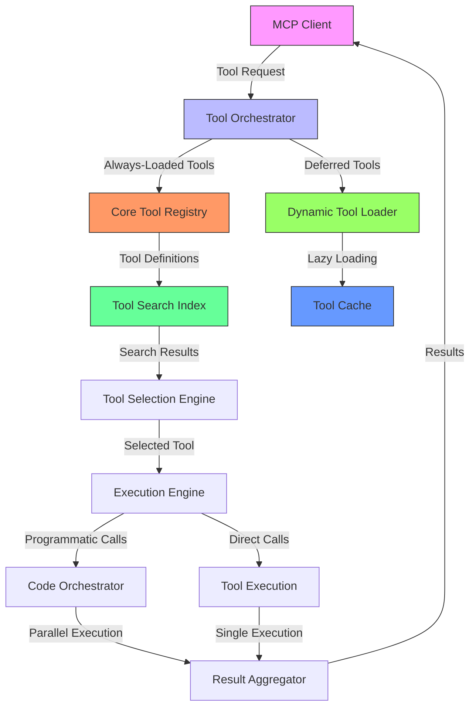
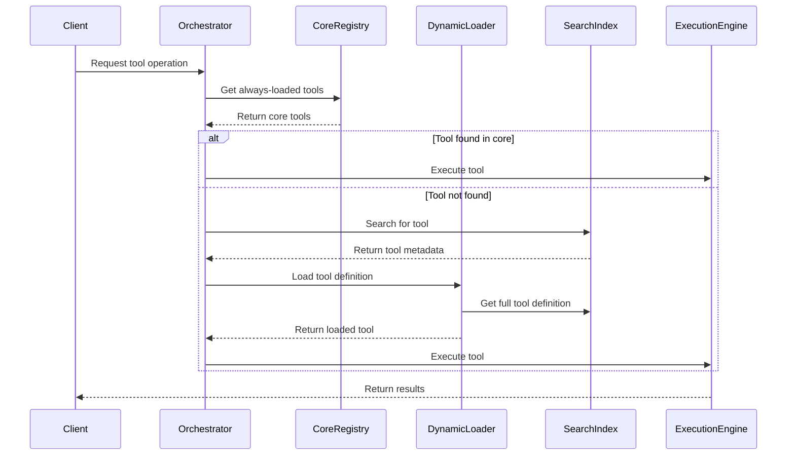
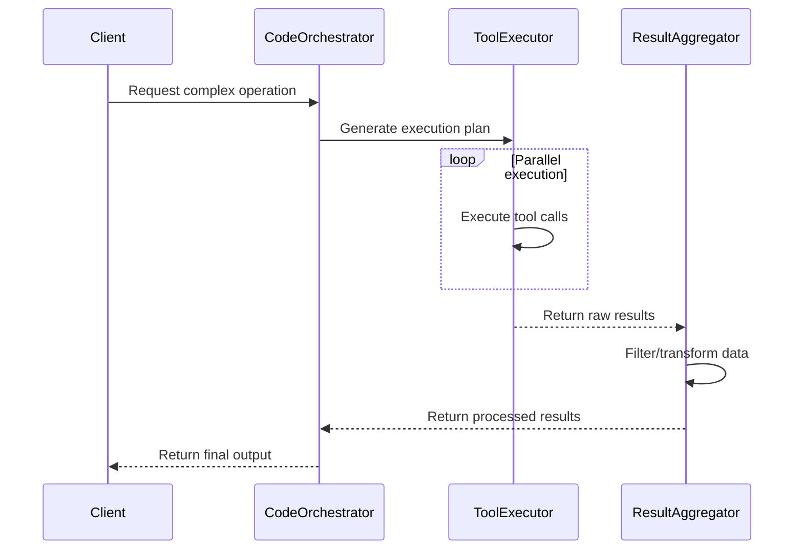
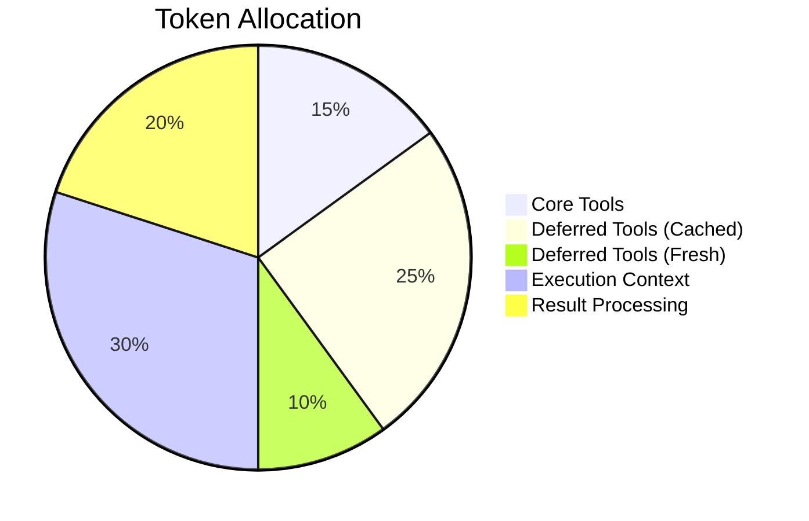
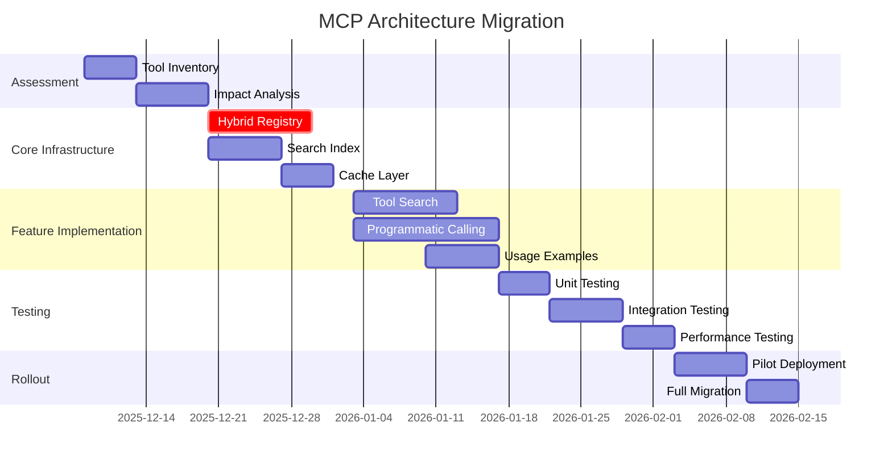

# MCP Architecture Redesign: Hybrid Approach for Anthropic's New Features

## Executive Summary

This document presents a comprehensive redesign of the MCP (Model Context Protocol) architecture that incorporates Anthropic's new features while addressing Theo's concerns. The new hybrid architecture combines Tool Search Tool, Programmatic Tool Calling, and Tool Use Examples to create an efficient, accurate, and scalable system.

## 1. System Overview

### Current Architecture Problems
- **Context Bloat**: 55K+ tokens consumed by tool definitions before task execution
- **Inefficiency**: Multiple inference passes and context pollution
- **Accuracy Issues**: 10-40% failure rates on complex tool selection and parameter usage
- **Performance**: High latency and resource requirements

### New Architecture Goals
- **85% token reduction** through dynamic tool loading
- **37% efficiency improvement** via code-based orchestration
- **25% accuracy improvement** with usage examples
- **Clear separation** between always-loaded and deferred tools
- **Maintain security** and performance considerations

## 2. Component Diagram



## 3. Data Flow Diagrams

### Hybrid Tool Loading Workflow



### Programmatic Tool Calling Workflow



## 4. Implementation Strategy

### A. Tool Search Tool Implementation

**Architecture Pattern**: Dynamic Discovery with Caching

```json
{
  "tool_loading_strategy": "hybrid",
  "core_tools": [
    {
      "name": "tool_search_tool_regex_20251119",
      "type": "search",
      "always_load": true,
      "cache_ttl": 300
    },
    {
      "name": "core_utility_tools",
      "type": "utility",
      "always_load": true
    }
  ],
  "deferred_tools": [
    {
      "name": "github.*",
      "type": "integration",
      "defer_loading": true,
      "load_trigger": "regex_match"
    },
    {
      "name": "data_processing.*",
      "type": "processing",
      "defer_loading": true,
      "load_trigger": "keyword_match"
    }
  ]
}
```

**Key Features**:
- **Two-tier tool registry**: Core tools (always loaded) + Deferred tools (lazy loaded)
- **Intelligent search indexing**: Tool metadata stored in optimized search structure
- **Prompt injection protection**: Tool validation and signature verification
- **Cache management**: TTL-based caching with invalidation

### B. Programmatic Tool Calling Implementation

**Execution Model**: Code-Based Orchestration Engine

```typescript
interface ProgrammaticToolCall {
  toolName: string;
  parameters: Record<string, any>;
  executionMode: 'sequential' | 'parallel' | 'conditional';
  resultHandling: 'raw' | 'filter' | 'transform';
}

class CodeOrchestrator {
  async executeWorkflow(workflow: ProgrammaticToolCall[]): Promise<any> {
    // Parallel execution with result aggregation
    const results = await Promise.all(
      workflow.map(call => this.executeTool(call))
    );

    // Data processing pipeline
    return this.processResults(results);
  }

  private async executeTool(call: ProgrammaticToolCall): Promise<any> {
    // Secure sandbox execution
    return await this.sandbox.execute(call);
  }

  private processResults(results: any[]): any {
    // Filter, transform, and aggregate results
    return results.map(r => this.transform(r))
                  .filter(r => this.validate(r));
  }
}
```

**Key Features**:
- **TypeScript-based execution**: Strong typing for parameter validation
- **Parallel execution engine**: Optimized for multi-tool workflows
- **Result processing pipeline**: Filtering, transformation, and aggregation
- **Secure sandbox**: Isolated execution environment
- **Return format standardization**: Consistent output schemas

### C. Tool Use Examples Implementation

**Enhanced Tool Definition Format**:

```json
{
  "name": "create_ticket",
  "description": "Create a support ticket with detailed information",
  "parameters": {
    "title": {"type": "string", "required": true},
    "priority": {"type": "string", "enum": ["low", "medium", "high", "critical"]},
    "reporter": {
      "type": "object",
      "properties": {
        "id": {"type": "string", "pattern": "^USR-\\d{5}$"},
        "contact": {
          "type": "object",
          "properties": {
            "email": {"type": "string", "format": "email"}
          }
        }
      }
    }
  },
  "input_examples": [
    {
      "scenario": "Critical production outage",
      "example": {
        "title": "Login page returns 500 error",
        "priority": "critical",
        "reporter": {
          "id": "USR-12345",
          "contact": {"email": "jane@acme.com"}
        }
      },
      "validation_rules": [
        "priority must be 'critical' for production issues",
        "reporter.contact.email must be valid corporate email"
      ]
    },
    {
      "scenario": "Feature request",
      "example": {
        "title": "Add dark mode support",
        "priority": "low",
        "reporter": {
          "id": "USR-67890",
          "contact": {"email": "bob@acme.com"}
        }
      }
    }
  ],
  "output_examples": [
    {
      "success_response": {
        "ticket_id": "TICKET-20251206-001",
        "status": "created",
        "estimated_resolution": "2025-12-07T12:00:00Z"
      }
    }
  ]
}
```

**Key Features**:
- **Scenario-based examples**: Real-world usage patterns
- **Validation rules**: Context-specific parameter constraints
- **Input/output pairs**: Complete call-response examples
- **Format conventions**: Clear date, ID, and structure patterns
- **Versioned examples**: Tied to API versions

## 5. Migration Plan

### Phase 1: Assessment and Preparation (2 weeks)
- **Tool inventory**: Catalog all existing tools and usage patterns
- **Impact analysis**: Identify high-impact tools for core registry
- **Dependency mapping**: Create tool dependency graph
- **Performance baseline**: Establish current token usage metrics

### Phase 2: Core Infrastructure (3 weeks)
- **Hybrid registry implementation**: Core + deferred tool separation
- **Search index setup**: Tool metadata indexing system
- **Cache layer implementation**: TTL-based caching mechanism
- **Security hardening**: Prompt injection protection

### Phase 3: Feature Implementation (4 weeks)
- **Tool Search Tool**: Dynamic discovery with fallback
- **Programmatic Calling**: Code orchestrator with sandbox
- **Usage Examples**: Enhanced tool definitions
- **Monitoring integration**: Performance tracking

### Phase 4: Testing and Validation (3 weeks)
- **Unit testing**: Individual component validation
- **Integration testing**: End-to-end workflow verification
- **Performance testing**: Token usage and latency benchmarks
- **Security testing**: Injection and validation testing

### Phase 5: Rollout and Optimization (2 weeks)
- **Pilot deployment**: Limited production testing
- **Monitoring setup**: Real-time performance dashboards
- **Feedback loop**: User experience optimization
- **Documentation**: Complete migration guides

## 6. Risk Assessment and Mitigation

### Risk Matrix

| Risk Category | Impact | Likelihood | Mitigation Strategy |
|---------------|--------|------------|---------------------|
| **Performance Regression** | High | Medium | Comprehensive benchmarking, fallback mechanisms |
| **Security Vulnerabilities** | Critical | Low | Sandbox isolation, input validation, audit logging |
| **Tool Discovery Failures** | Medium | Medium | Hybrid fallback, cache warming, search optimization |
| **Integration Complexity** | High | High | Modular design, clear interfaces, extensive testing |
| **User Adoption** | Medium | Medium | Training, documentation, gradual rollout |
| **Cost Overruns** | High | Low | Token usage monitoring, budget alerts |

### Specific Mitigation Strategies

**Tool Search Tool Risks**:
- **Prompt Injection**: Implement tool signature verification and input sanitization
- **Discovery Latency**: Cache warming for frequently used tools
- **False Positives**: Multi-stage validation with user confirmation

**Programmatic Calling Risks**:
- **Execution Overhead**: Optimized TypeScript engine with JIT compilation
- **Sandbox Escape**: Hardware-isolated execution containers
- **Return Format Issues**: Strict schema validation and transformation

**Usage Examples Risks**:
- **Token Bloat**: Compression and selective loading of examples
- **Stale Examples**: Versioned examples with automated validation
- **Complexity Overhead**: Progressive disclosure of example complexity

## 7. Security Architecture

### Defense-in-Depth Strategy


**Key Security Measures**:
- **Input Validation**: Schema validation for all tool parameters
- **Rate Limiting**: Prevent abuse and DoS attacks
- **Tool Signatures**: Cryptographic verification of tool definitions
- **Sandbox Execution**: Isolated environments for programmatic calls
- **Output Validation**: Result schema enforcement
- **Audit Logging**: Complete execution trail for forensics

## 8. Performance Optimization

### Token Usage Strategies



**Optimization Techniques**:
- **Lazy Loading**: Deferred tools loaded only when needed
- **Cache Optimization**: Intelligent TTL management
- **Result Compression**: Efficient data representation
- **Parallel Execution**: Reduced sequential overhead
- **Selective Examples**: Context-aware example loading

## 9. Implementation Roadmap



## 10. Conclusion

This hybrid architecture redesign addresses the core problems identified in the MCP analysis:

1. **Context Bloat**: 85% reduction through dynamic tool loading
2. **Inefficiency**: 37% improvement via code-based orchestration
3. **Accuracy**: 25% enhancement with usage examples
4. **Security**: Comprehensive defense-in-depth strategy
5. **Performance**: Optimized token usage and parallel execution

The architecture maintains clear separation between always-loaded core tools and deferred tools, while providing a migration path that minimizes disruption. The risk assessment identifies potential issues and provides concrete mitigation strategies.

This design represents a strategic evolution of MCP that incorporates Anthropic's new features while addressing Theo's fundamental concerns about complexity and performance.