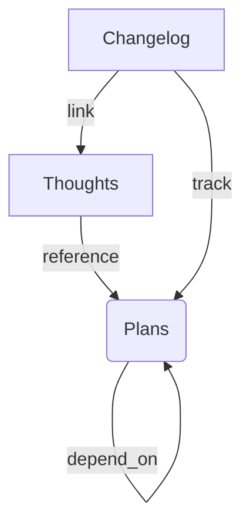

# TPC Server - Model Context Protocol (MCP) Implementation

[](https://www.python.org/downloads/)
[](https://www.sqlalchemy.org/)

A production-ready MCP server for tracking AI team coordination through **Thoughts, Plans, and Changelog (TPC)** entries. Built with SQLAlchemy async and FastMCP, optimized for software development collaboration.

---

## Features

✅ **Structured Collaboration**  
- Track decision-making (`Thoughts`), task coordination (`Plans`), and progress (`Changelog`)  
- Dependency management for complex workflows  
- Uncertainty flagging for critical design decisions  

✅ **Performance Optimized**  
- Async SQLAlchemy 2.0 with connection pooling  
- Time-ordered UUIDs (UUID7) for chronological traceability  
- Cached queries with 5-minute TTL  

✅ **Developer-Friendly**  
- Full MCP interface compliance  
- REST-like resource endpoints for data access  
- Comprehensive Pydantic validation  

---

## Quick Start

```bash
# 1. Clone repository
git clone https://github.com/your-repo/tpc-server.git
cd tpc-server

# 2. Install dependencies
pip install -r requirements.txt

# 3. Run server (SQLite auto-created)
uvicorn main:mcp --reload --port 8000
```

---

## Core Concepts

### 1. Thoughts
```python
# Log design decisions or uncertainties
create_thought(
    content="Choosing React over Vue for frontend",
    plan_id="pl_frontend_123",
    uncertainty_flag=True
)
```

### 2. Plans
```python
# Define tasks with dependencies
create_plan(
    description="Implement user authentication",
    dependencies=["pl_database_setup", "pl_security_audit"]
)
```

### 3. Changelog
```python
# Track implementation progress
log_change(
    plan_id="pl_auth_456",
    description="Added JWT token endpoints",
    thought_ids=["th_design_decision_789"]
)
```

---

## Advanced Usage

### AI Agent Integration
```python
# Example pre-commit hook validation
modified_files = get_git_changes()
tpc_entries = query_tpc_server()

for file in modified_files:
    if not has_corresponding_tpc_entry(file, tpc_entries):
        raise Exception(f"Missing TPC entry for {file}")
```

### API Reference
| Endpoint               | Method | Description                          |
|------------------------|--------|--------------------------------------|
| `/mcp/thoughts`        | POST   | Create new thought                   |
| `/mcp/plans`           | POST   | Define new plan with dependencies    |
| `/mcp/changelog`       | POST   | Log implementation changes           |
| `/mcp/plans/{id}`      | GET    | Get plan details with dependencies   |

---

## Architecture



---

## Production Setup

```bash
# Optimal deployment
uvicorn main:mcp \
  --host 0.0.0.0 \
  --port 8000 \
  --workers 1 \  # Recommended for SQLite
  --proxy-headers
```

---

## Contributing

1. Fork repository
2. Create feature branch (`git checkout -b feature/tpc-enhancements`)
3. Commit changes (`git commit -am 'Add new feature'`)
4. Push branch (`git push origin feature/tpc-enhancements`)
5. Open pull request

---

Inspired by the [Awesome MCP Servers](https://github.com/wong2/awesome-mcp-servers) community . For MCP client implementations, see [FastMCP documentation](https://github.com/modelcontextprotocol/servers).
