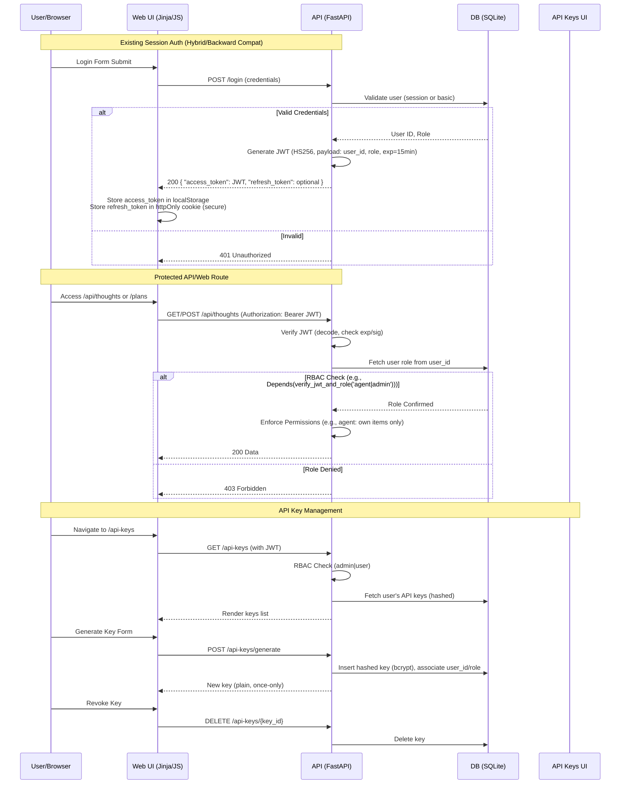

# Auth Iteration 2 Specifications for TPC Server (Partially Implemented Post-Cleanup)

## Overview
This document outlines the technical specifications for enhancing authentication in the TPC Server project. Post-cleanup, User and ApiKey models are inline in main.py, auth.py provides JWT/RBAC/API key utils, but imports/middleware/routes are disabled for local dev (hybrid fallback to local_user). templates/api_keys.html and models/ dir removed. Current state addresses partial MVP limitations; full activation pending (uncomment imports, add routes like /login /api-keys, enable middleware).

Goals:
- Secure, stateless auth via JWT (pending activation).
- Role enforcement (e.g., 'agent' for AI-limited access, 'admin'/'user' for human full access; models ready).
- User-friendly API key generation/revocation UI (specs updated for inline models, no dedicated template).

## 1. High-Level Architecture Diagram
The following Mermaid diagram illustrates the auth flow: login issues JWT, protected routes verify token and enforce RBAC, with optional refresh and API key integration.

## 2. Detailed Specifications for Each Feature

### JWT Integration
Replace session auth with JWT for API calls; hybrid for web (JWT primary, fallback to sessions for legacy). Use PyJWT library (add to `requirements.txt`: `PyJWT==2.8.0`).

- **File Changes (Partial - Disabled for Local)**:
  - `auth.py`: JWT utilities implemented but imports disabled in main.py.
    - `create_access_token(data: dict, expires_delta: timedelta)`: Encode payload with HS256 (secret from env `JWT_SECRET`), exp delta (default 15min).
    - `create_refresh_token(data: dict)`: Longer exp (7 days), separate secret.
    - `verify_token(token: str)`: Decode, validate sig/exp, return payload (user_id, role).
    - `get_current_user(token: str = Depends(oauth2_scheme))`: Extract from Authorization header, verify, fetch user from DB.
    - Update existing `verify_agent` to optionally accept JWT.
  - `main.py`:
    - Models: User/ApiKey inline (disabled imports from auth.py).
    - Pending: Add `/login` endpoint: POST, validate credentials, issue JWT.
    - Pending: Add `/refresh` endpoint: POST with refresh_token, issue new access_token.
    - Protected routes: Hybrid middleware commented; update to `Depends(get_current_user)`, add `oauth2_scheme = OAuth2PasswordBearer(tokenUrl="login")`.
    - API routes (e.g., `/api/thoughts`): Ready for `Authorization: Bearer <token>`.
  - `static/js/app.js`:
    - Pending: On login success: `localStorage.setItem('access_token', token);`
    - Pending: For fetch calls: `headers: { 'Authorization': `Bearer ${localStorage.getItem('access_token')}` }`
    - Pending: Token expiry check: On 401, redirect to login or refresh.
    - Secure storage: localStorage for access (web), httpOnly cookie for refresh (via set-cookie in response).
  - `templates/base.html`: Add meta for CSRF if hybrid sessions retained (current: no changes needed).

- **Data Flow**:
  - Login: Credentials → Validate → Payload `{ "user_id": 1, "role": "agent", "exp": timestamp }` → Sign JWT → Return token.
  - API Call: Header `Authorization: Bearer eyJ...` → Decode → Extract user_id/role → DB query for user details → Proceed if valid.
  - Refresh: Refresh token → Validate → New access token → Update storage.
  - Token Payload: Minimal (user_id, role, iat, exp); no sensitive data.

### RBAC (Role-Based Access Control)
Define roles: 'agent' (AI: create/update own thoughts/plans/changes), 'user' (human: view all, manage own + limited), 'admin' (human: full CRUD on all).

- **File Changes**:
  - Models inline in `main.py`: User with `role: str` (default 'user'); ApiKey table ready.
    - No separate models/ dir (removed post-cleanup); update via SQL in lifespan.
  - `auth.py`: `verify_jwt_and_role(required_roles: str)` implemented: After JWT verify, check `payload['role'] in required_roles.split('|')`.
  - `main.py`:
    - Pending: Routes: `@app.post("/api/thoughts", dependencies=[Depends(verify_jwt_and_role('agent|admin'))])`
    - For agent-specific: Query filter `where agent_signature == current_user.username` (hybrid fallback).
    - Web routes (e.g., `/thoughts`): Use `@app.get("/thoughts", dependencies=[Depends(get_current_user_hybrid)])`; template logic ` show all ` (current: no role checks).
  - `templates/*.html` (e.g., `thoughts.html`): Pending Jinja conditionals for role-based UI (e.g., bulk delete button only for admin).
  - `static/js/app.js`: Client-side checks (e.g., hide UI elements if !admin), but server-enforced (current: no role logic).

- **Data Flow**:
  - On login/JWT: Role from DB → Embed in payload.
  - Route access: Token → Verify → Role check → If pass, fetch/enforce data scope (e.g., SQL `WHERE owner_id = :user_id OR role = 'admin'`).
  - Permissions: Granular per resource (thoughts: agent own only; plans: user all read, admin write).

### API Key Management UI
New self-service page for generating/revoking API keys (hashed storage, associated with user/role). Keys for external API access (e.g., agents).

- **File Changes (Partial - No UI Post-Cleanup)**:
  - Models inline in `main.py`: ApiKey table: `id, user_id (FK), key_hash (str), role (str), created_at, revoked_at (optional)`.
  - `auth.py`: `validate_api_key(key: str)` implemented: Hash key (bcrypt), query DB for match, return user/role if valid.
    - Update API routes to accept `X-API-Key` header as alt to JWT (pending enable).
  - `main.py`:
    - Pending: `@app.get("/api-keys", dependencies=[Depends(get_current_user_hybrid)])`: List user's keys (exclude hash).
    - Pending: `@app.post("/api-keys/generate", dependencies=[Depends(verify_hybrid_and_role('user|admin'))])`: Generate random key (uuid), hash, insert DB, return plain key (once).
    - Pending: `@app.delete("/api-keys/{key_id}", dependencies=[Depends(verify_hybrid_and_role('user|admin'))])`: Set revoked_at.
  - No `templates/api_keys.html` (removed post-cleanup); integrate into existing pages or add new template.
  - `templates/base.html`: Pending nav link `<a href="/api-keys">API Keys</a>` (role-conditional: ``).
  - `static/js/app.js`: Pending: Fetch `/api-keys`, handle generate/revoke POSTs with token.
  - `static/css/style.css`: Styles for table/modal (add as needed).

- **Data Flow**:
  - Generate: User submits role → Server generates key → Hash & store → Return plain key → Client displays (warn: copy once).
  - List: JWT auth → Query user's keys → Render table.
  - Revoke: Select key → POST delete → Update DB.
  - Usage: API call with `X-API-Key: plain_key` → Hash & validate → Proceed as user/role.

## 3. Integration Plan
- **Backward Compatibility**: Hybrid mode implemented but disabled (middleware commented; fallback local_user). Retain for web UI, add JWT opt-in. Existing agent_id/secret → Map to JWT on first use. Deprecate sessions post-MVP.
- **UI/JS Updates**:
  - Pending: Login form: On success, store JWT instead of session ID.
  - Pending: Auth prompts: Redirect to `/login` on 401, auto-refresh on expiry.
  - Existing pages (e.g., `/thoughts`): Add role-based filters in JS (fetch with token, hide unauthorized; current: no role logic).
- **Tie into New Features**:
  - Bulk ops (e.g., delete multiple thoughts): Require 'admin' role check in endpoint (pending).
  - API keys: Integrate with agent auth – agents use keys for programmatic access (models ready).
  - Migration: No models/ dir (removed); run SQL in lifespan to add role column (default 'user'), create api_keys table. Update existing users (e.g., agents as 'agent').
- **Testing**: Unit (JWT utils in auth.py), integration (end-to-end login→access pending routes), manual (UI key gen pending template).

## 4. Potential Risks and Mitigations
- **Token Security**: Risk: Exposure/theft. Mitigation: HS256 with strong secret (env var, rotate), short expiry (15min access, refresh separate), no sensitive payload data. Use HTTPS in prod.
- **JWT Revocation**: Risk: Stolen token valid until exp. Mitigation: Short expiry + refresh tokens (revokable via DB blacklist); optional token ID in payload for revocation list.
- **DB Migration**: Risk: Data loss/corruption. Mitigation: Backup DB pre-migration; use Alembic for schema changes; add role defaults without breaking queries.
- **Frontend Token Exposure**: Risk: XSS in localStorage. Mitigation: Sanitize JS, use httpOnly for refresh; CSP headers. Alt: Cookies for all, but task specifies localStorage for web.
- **RBAC Complexity**: Risk: Over-permissive checks. Mitigation: Server-side enforcement only; audit roles in code; unit tests for each dependency.
- **Performance**: Risk: DB hits per request. Mitigation: Cache roles in JWT (refresh on change); stateless where possible.
- **Compatibility Break**: Risk: Existing clients fail. Mitigation: Versioned API (/v1 vs /v2), gradual rollout, docs update in README.md.